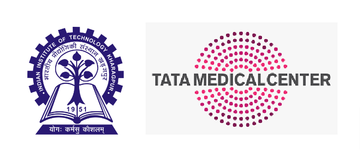
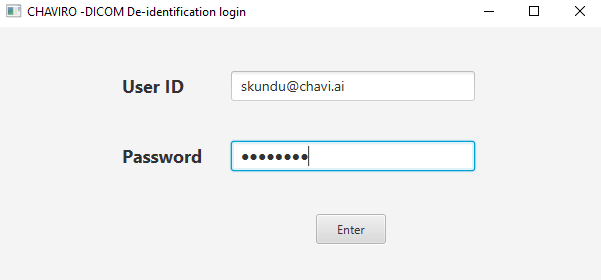
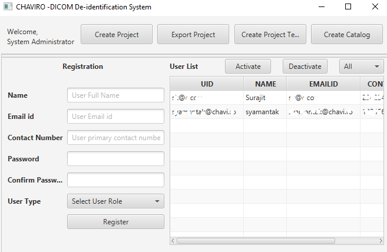
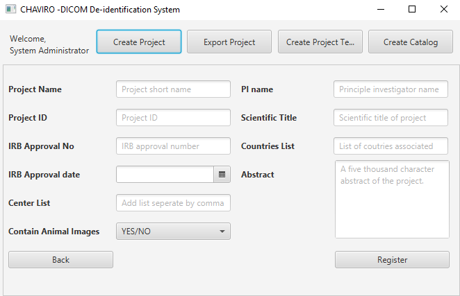
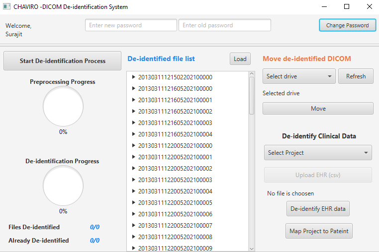
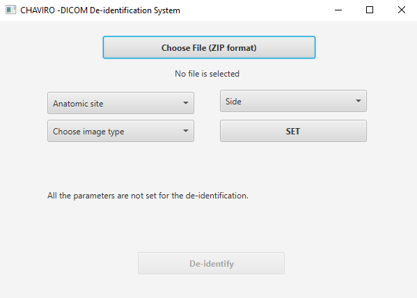
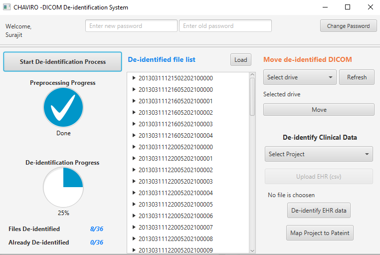
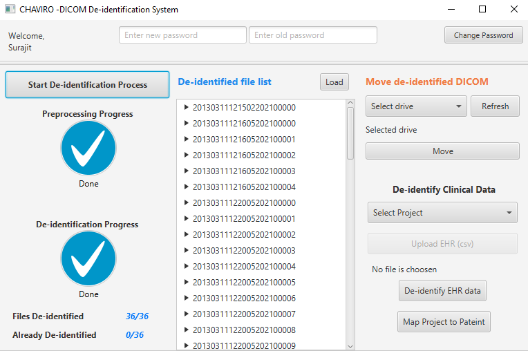

<!-- # CHAVI3DS -->
<!-- Software for medical imaging data bank created by IIT, Kharagpur and Tata Medical Center, Kolkata -->

<!-- # CHAVI3DS -->
<!-- Software for medical imaging data bank created by IIT, Kharagpur and Tata Medical Center, Kolkata -->

<!-- PROJECT LOGO -->
  <h3 align="center" id="top">CHAVID3S: CHAVI DICOM DATA DE  
IDENTIFICATION SYSTEM</h3>

  <p align="center">
   The user manual for the step-by-step installation and use of CHAVID3S.
    <br />
    <a href="CHAVI_DDIS_User_Manual_v1.pdf"><strong>Explore the docs in PDF»</strong></a>
    <br />
    <br />
    <a href="#">Request Demo</a>
    ·
    <a href="https://github.com/jmGithub2021/CHAVI3DS/issues">Report Bug</a>
    ·
    <a href="#">Request Feature</a>
  </p>
</div>
<div class="title-page">
 <p align="center">
This is collaborative project between Indian Institute of Technology Kharagpur and Tata Medical centre Kolkata
</p>

<h3 align="center">
Lead Investigators
</h3>
<div align="center">
<label>Prof. Jayanta Mukhopadhyay</label>  
<div>Department of Computer Science and Engineering</div>  
Indian Institute of Technology, Kharagpur  
<div>Email: jay@cse.iitkgp.ac.in</div>
</div>
</div>
<p align="center"> and</p>
<div align="center">
<label>Dr. Sanjoy Chatterjee</label>  
<div>Department of Radiation Oncology</div>  
Tata Medical Center, Kolkata  
<div>Email: sanjoy.chatterjee@tmckolkata.com</div>
</div>
</div>
<!-- <div align="center">
<h3> Team</h3>
Surajit Kundu, Santam Chakraborty, Jayanta Mukhopadhyay, Sanjoy Chatterjee, Rimpa Basu  
Achari, Indranil Mallick, Partha Pratim Das, Moses Arunsingh, Tapesh Bhattacharyyaa,  
Soumendranath Ray
</div> -->
<br/>
<div align="center">

</div>

<br>
<!-- TABLE OF CONTENTS -->
<details>
  <summary>Table of Contents</summary>
  <ol>
    <li>
      <a href="#an-overview">An Overview</a>
      <ul>
        <li><a href="#prerequisite-terms-and-definition">Prerequisite terms and definition</a>		</li><ul>
        <li><a href="#dicom">DICOM</a></li>
        <li><a href="#rtstruct">RTSTRUCT</a></li>
        <li><a href="#rtplan">RTPLAN</a></li>
        <li><a href="#rtdose">RTDOSE</a></li>
        <li><a href="#de-identification">De-identification</a></li>
        </ul>
      </ul>
    </li>
    <li><a href="#scopes-and-utilization">Scopes and Utilization</a></li>
    <li>
      <a href="#getting-started">Getting Started</a>
      <ul>
        <li><a href="#requirements">Requirements</a></li>
        <li><a href="#installation">Installation</a></li>
        <li><a href="#user-roles">User Roles</a></li>
         <ul>
        <li><a href="#administrator">Administrator</a></li>
         <ul>
        <li><a href="#user-management">User Management</a></li>
        </ul>
        <li><a href="#users">Users</a></li>
        </ul>
        <li><a href="#DICOM-De-identification-Process">DICOM De-identification Process</a></li>
        <li><a href="#Clinical-Data-de-identification-Process">Clinical Data de-identification Process</a></li>
      </ul>
    </li>
    <li><a href="#disclaimer">Disclaimer</a></li>
    <li><a href="#license">License</a></li>
    <li><a href="#acknowledgments">Acknowledgments</a></li>
    <li><a href="#references">References</a></li>
    <li><a href="#contact">Contact</a></li>

  </ol>
</details>


<!-- ABOUT THE PROJECT -->
## An Overview

[![Product Name Screen Shot][product-screenshot]](https://chavi.ai)

CompreHensive ArchiVe of Imaging (CHAVI) DICOM Data De-identification System (CHAVID3S) version 1.0 [1] has been developed for the de-identification of radiological DICOM images and associates radiation therapy (RT) planning (RTPLAN), structure (RTSTRUCT), and dose (RTDOSE) data. It is a standalone application that is built using Java. The graphical user interface (GUI) is designed using JavaFX. The CHAVID3S uses a MySQL relational database management system (RDBMS) to store the data, which keeps tracking the references of the data in encrypted form for re-identification. This system is also capable of de-identifying the clinical data where the de-identification is  
defined in the context of research goals and objectives [2].


### Prerequisite terms and definition

#### DICOM
Digital Imaging and Communications in Medicine (DICOM) is an international medical standard that specifies a data interchange protocol for medical images and their associated information across all fields of medicine [3].

#### RTSTRUCT
In DICOM, a radiotherapy plan (RTPLAN) object contains geometric and dosimetric data specifying a course of the external beam or brachytherapy treatment. An RTPLAN object can be generated by manually entering data from the TPS. It usually keeps the references of an RTSTRUCT to define a coordinate system and set of patient structures.

#### RTPLAN
In DICOM, a radiotherapy plan (RTPLAN) object contains geometric and dosimetric data specifying a course of the external beam or brachytherapy treatment. An RTPLAN object can be generated by manually entering data from the TPS. It usually keeps the references of an RTSTRUCT to define a coordinate system and set of patient structures.

#### RTDOSE
The radiotherapy dose (RTDOSE) object of the DICOM standard is used for transferring the dose distributions calculated by radiation therapy TPS. The dose distributions in an RTDOSE may be presented as 2D or 3D grids.

#### De-identification
De-identification is a process of detecting the patients’ personal identifiers and removing or modifying those  identifiers from the data

<p align="right">(<a href="#top">back to top</a>)</p>

## Scope and Utilization
Analysis of radiological data, particularly in radiation oncology, has many challenges in the imaging field, clinical research, technology, and computation.
<b>Radiomics</b> involves the high-throughput extraction of quantitative imaging features with the intent of creating mineable databases from radiological images.


<!-- GETTING STARTED -->
## Getting Started
[](https://www.youtube.com/watch?v=TF3nGqsIrHk&ab_channel=CHAVI)


### Requirements

* [![Java][Java]][Java-url]
* [![MySql][Mysql]][Mysql-url]
* [![dcm4che][dcm4che]][dcm4che-url]
* [![NetBeans][Netbeans]][Netbeans-url]

The CHAVID3S can be executed through both Windows and Linux operating systems. It is  recommended to run the de-identification system using Windows operating system.

<table>
<thead>
<tr>
<th>Key Name</th>
<th>Definition</th>
<th>Default Value</th>
</tr>
</thead>
<tbody>
<tr>
<td>dbName</td>
<td>Database name</td>
<td>chaviro</td>
</tr>
<tr>
<td>dbURL</td>
<td>Database URL with port number</td>
<td>jdbc:mysql://localhost:3306/</td>
</tr>
<tr>
<td>dbUsername</td>
<td>Database user name</td>
<td>root</td>
</tr>
<tr>
<td>dbPassword</td>
<td>Database password</td>
<td>xixjm4WhSMFQVBkaVl59oA==</td>
</tr>
<tr>
<td>dbDriver</td>
<td>Using JDBC database driver</td>
<td>com.mysql.jdbc.Driver</td>
</tr>
<tr>
<td>deidentifiedDCMSource</td>
<td>De-identified file directory</td>
<td>/deidentifiedDICOM/</td>
</tr>
<tr>
<td>globalPath</td>
<td>Full path where the CHAVID3S is located</td>
<td>C:/Users/{"username"}/Documents/</td>
</tr>
<tr>
<td>tempDirectory</td>
<td>Set a directory for storing the temporary files</td>
<td>C:/Users/{"username"}/Documents/\\NetBeansProjects/DICOMDIS/temp/</td>
</tr>
<tr>
<td>globalID</td>
<td>It is unique identification for a CAHVID3S</td>
<td>2013031112</td>
</tr>
<tr>
<td>encryptionKey</td>
<td>This encryption key is used across the system for encryption/decryption.</td>
<td>CHAVI-RO@S.KUNDU</td>
</tr>
<tr>
<td>patientIDFormat</td>
<td>It is used if there is a specific format of original patient id.</td>
<td>MR/00/000000</td>
</tr>
<tr>
</tr>
</tbody>
</table>


### Installation

_Below is the step by step process that instruct the audience on installing and setting up CHAVID3S app._

<b>Step 1.</b> Clone the CHAVID3S from GitHub repository. 
   ```sh
   git clone https://github.com/your_username_/Project-Name.git
   ```
<b>Step 2.</b> Create a database in MySQL and import the `chavid3s.sql` file.
   ```sh
   create database chaviro
   mysql -u username -p chaviro < chavid3s.sql
   ```
<b>Step 3.</b> Configure the `config.json` file. Kindly refer to above Table for more details. 
   ```
   Note: Please generate the encryption string for your MySQL database password. The default encryption password is generated for string ``1234".
   ```
<b>Step 4.</b> Open the project using Netbeans IDE.

<b>Step 5.</b> Apply `Clean and build` project.

<b>Step 6.</b> Click on `Run` button to execute the application.

<p align="right">(<a href="#top">back to top</a>)</p>

### User Roles
In order to access the CHAVID3S, a user needs to have a login credential. The CHAVID3S has role-based control to restrict the access limit of different modules. There are two types of roles <i><b>users</b></i> and <i><b>administrators</b></i>. The user can log in to the system using the `User ID` and `Password` as shown in Figure 1.
<div align="center">

</div>

#### Administrator
An Administrator has regulatory control over the system to manage the users' accounts and project creation. In this context, a project may be defined according to the type of cancer found at a certain anatomical location.
##### User Management
As shown in Figure \ref{user_account}, this interface is used to create the users' accounts. The administrator will provide the required information following Name, Email-ID, Contact Number, Password, and user role. The email ID will work as a login id to access the CHAVID3S.  
The administrator has the control to deactivate and activate the users' accounts by clicking the corresponding button as shown in Figure 2

#### Users
A user is primarily assigned for the de-identification of both DICOM images and clinical datasets.The GUI of a user is shown in Figure 4. The user has access to the following modules
* De-identify the DICOM images by clicking on the <b>Start De-identification Process</b> button.
* Clinical data can be de-identified by selecting the project name followed by choosing the clinical data (CSV format) from the <b>De identify clinical data</b> section at right-bottom. Then the user has to click on the <b>De-identify EHR data</b> button.
* The de-identified files can be moved to any external/internal media drive. The user has to select the de-identified folder from the <b>De-identified file list</b>. Then the target drive needs
<center>
<div  align="center">

<p> Figure 1: Login Page </p>
</div>
</center>

<center>
<div  align="center"">

<p> Figure 2: User account management Interface </p>
</div>
</center>

to be selected from the <b>select drive</b> dropdown followed by clicking the <b>Move</b> button from the <b>Move de-identified DICOM</b> section at the top-right.
* Users are advised to change the password after the first login. The password-management module is available at the top as shown in Figure 4.

<center>
<div  align="center">

<p> Figure 3: Project creation interface </p>                                            
</div>
</center>

<p align="right">(<a href="#top">back to top</a>)</p>


<!-- DICOM De-identification Process -->
### DICOM De-identification Process
The CHAVID3S supports the de-identification of single DICOM or multiple files in compressed
zip format. The DICOM de-identification interface is shown in Figure 5. Please refer to Figure
5 for the step-by-step process of DICOM de-identification.

* <b>Step 1.</b> Select a single DICOM or multiple in zip format by clicking the <b>“Choose File (ZIP format)”</b> button.
* <b>Step 2.</b> Choose the anatomic site from the <b>“Anatomic Site”</b> dropdown list.
* <b>Step 3.</b> Pick the laterality of the anatomical site from the <b>“Side”</b> dropdown list.
* <b>Step 4.</b> Select the radiological study type from the <b>“Choose Image Type”</b> dropdown list.
* <b>Step 5.</b> Click on the <b>“SET”</b> button to check whether the valid data is provided or not.If everything is okay, <b>“De-identify”</b> button will be activated, otherwise, the system will guide the user by displaying the proper message.
* <b>Step 6.</b> Click on the <b>“De-identify”</b> button to de-identify the DICOM dataset. Once the de-identification is started, the progress status can be viewed from the same interface as shown in Figure 6.

<p align="right">(<a href="#top">back to top</a>)</p>

<!-- Clinical Data de-identification Process -->
### Clinical Data de-identification Process
We follow a specific format while acquiring the original clinical data. The template is provided in <b>“xls”</b> format for four projects. The original clinical data needs to be stored in a CSV file. Please refer to Figure 4 for the step-by-step process of clinical data de-identification.

<center>
<div  align="center">

<p> Figure 4: User interface for de-identification </p>
</div>
</center>

<center>
<div  align="center">

<p> Figure 5: DICOM de-identification interface </p>                                                       
<div>
</center>
<center>  
<div align="center">  
 <div>                  
 
 
 </div>
<p> Figure 6: De-identification progress status </p>                                                      
</div>
                                                      
</center>  
  
</div>

* <b>Step 1.</b> Select the project from <b>“De-identify Clinical Data”</b> section at bottom-right.
* <b>Step 2.</b> Choose the original clinical data file by clicking on <b>“Upload EHR (csv)”</b> button.
* <b>Step 3.</b> Click on the <b>“De-identify EHR Data”</b> button to execute the clinical data de-identification process.

<p align="right">(<a href="#top">back to top</a>)</p>

<!-- Disclaimer -->
## Disclaimer
Neither the CHAVI community nor any of its members shall be liable for any direct, indirect, incidental, special, exemplary, or consequential damages.
<p align="right">(<a href="#top">back to top</a>)</p>

<!-- LICENSE -->
## License
Distributed under Apache-2.0. See `LICENSE.txt` for more information.

<p align="right">(<a href="#top">back to top</a>)</p>

<!-- Acknowledgments -->
## Acknowledgments

<p align="right">(<a href="#top">back to top</a>)</p>

<!-- Reference -->
## References

[[1] S. Kundu, S. Chakraborty, S. Chatterjee, S. Das, R. B. Achari, J. Mukhopadhyay, P. P. Das, I. Mallick,
M. Arunsingh, T. Bhattacharyyaa et al., “De-identification of radiomics data retaining longitudinal temporal
information,” Journal of medical systems, vol. 44, no. 5, pp. 1–15, 2020.](https://github.com)

[[2] S. Kundu, S. Chakraborty, J. Mukhopadhyay, S. Das, S. Chatterjee, R. Basu Achari, I. Mallick, P. Pratim Das,
M. Arunsingh, T. Bhattacharyya et al., “Research goal-driven data model and harmonization for de-identifying
patient data in radiomics,” Journal of Digital Imaging, vol. 34, no. 4, pp. 986–1004, 2021.](https://github.com)

[[3] P. Mildenberger, M. Eichelberg, and E. Martin, “Introduction to the dicom standard,” European radiology,
vol. 12, no. 4, pp. 920–927, 2002.](https://github.com)

[[4] P. Lambin, E. Rios-Velazquez, R. Leijenaar, S. Carvalho, R. G. Van Stiphout, P. Granton, C. M. Zegers,
R. Gillies, R. Boellard, A. Dekker et al., “Radiomics: extracting more information from medical images using
advanced feature analysis,” European journal of cancer, vol. 48, no. 4, pp. 441–446, 2012.](https://github.com)

<p align="right">(<a href="#top">back to top</a>)</p>

<!-- CONTACT -->
## Contact

<p align="right">(<a href="#top">back to top</a>)</p>


[product-screenshot]: https://chavi.ai/sites/default/files/New%20Logo_0.png
[Java]: https://img.shields.io/badge/Java-5382a1?style=for-the-badge&logo=java&logoColor=f89820
[Java-url]: https://www.oracle.com/in/java/technologies/downloads/
[Mysql]: https://img.shields.io/badge/MySql-f29111?style=for-the-badge&logo=mysql&logoColor=00758f
[Mysql-url]: https://www.mysql.com/
[dcm4che]: https://img.shields.io/badge/dcm4che-e02f36?style=for-the-badge&logo=java&logoColor=f89820
[dcm4che-url]: https://www.dcm4che.org/
[Netbeans]: https://img.shields.io/badge/NetBeans-f1f3f4?style=for-the-badge&logo=apachenetbeanside&logoColor=1c7dc2
[Netbeans-url]: https://netbeans.apache.org/
